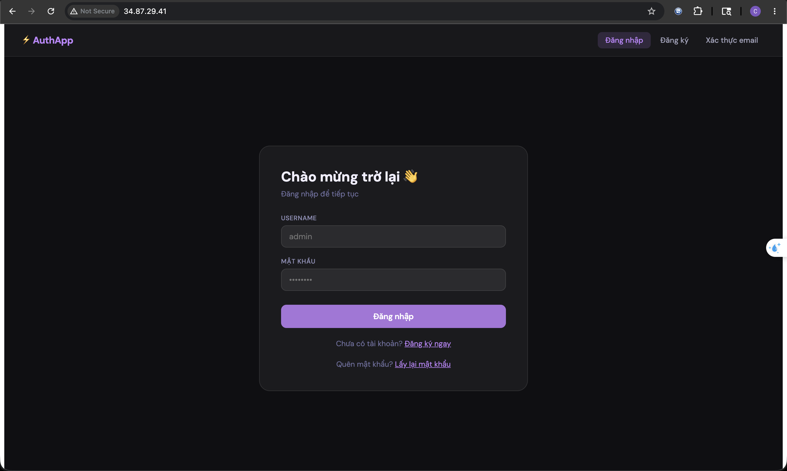
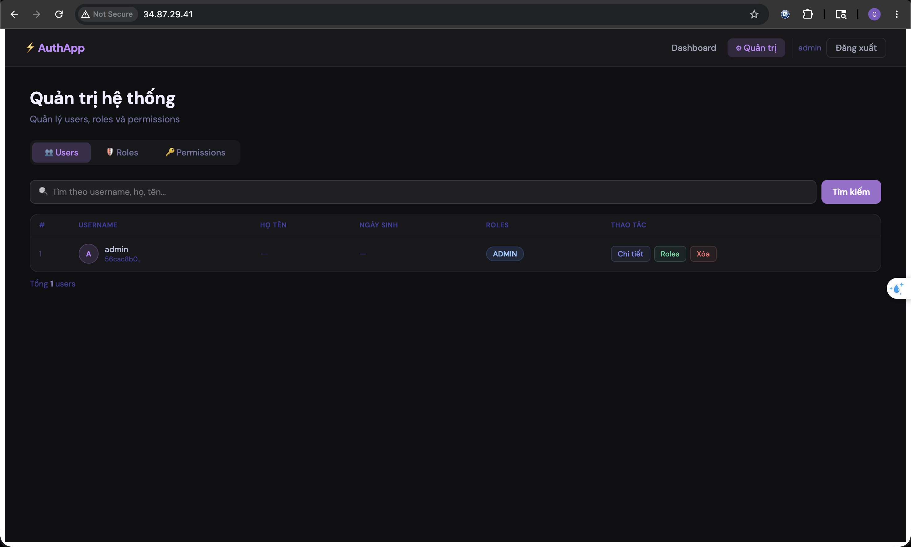

Identity Management System

A full-stack Identity & User Management System built with Spring Boot, ReactJS, JWT Authentication, Role-Based Access Control (RBAC), and Docker.

This project provides a complete authentication and authorization solution with user management, role/permission control, email verification, refresh token authentication, and admin dashboard UI.

🚀 Live Demo: http://34.87.29.41/

🛠️ Tech Stack

Backend

- Java 21
- Spring Boot 3
- Spring Security
- Spring Data JPA
- Hibernate
- JWT Authentication
- MySQL
- Maven
- Docker

Frontend

- ReactJS
- TypeScript
- Vite
- TailwindCSS
- Axios
- React Router

DevOps

- Docker & Docker Compose
- Nginx Reverse Proxy
- Google Cloud VM (Ubuntu)

⸻

✨ Features

Authentication

- User Registration
- Login with JWT
- Refresh Token Authentication
- Logout
- Email Verification
- Protected APIs

Authorization

- Role-Based Access Control (RBAC)
- Permission Management
- Admin/User Roles

User Management

- Create User
- Update User
- Delete User
- Search & Pagination
- Enable/Disable Account

Security

- BCrypt Password Encryption
- JWT Access Token
- Refresh Token Storage
- Spring Security Integration

Frontend Dashboard

- Authentication UI
- Admin Dashboard
- User Table Management
- Responsive UI

⸻

📁 Project Structure

    identity-project/
    │
    ├── identity-service/     # Spring Boot Backend
    │
    ├── identity-ui/          # React Frontend
    │
    └── docker-compose.yml

⚙️ Backend Setup

1. Clone Project

git clone https://github.com/trongkha0408/identity-project.git
cd identity-project

2. Configure Environment Variables

Create .env file:

    MYSQL_ROOT_PASSWORD=your_password

    MAIL_USERNAME=your_email@gmail.com
    MAIL_PASSWORD=your_app_password

3. Run With Docker

   docker compose up -d --build

🐳 Docker Architecture

    Client Browser
        ↓
        Nginx
        ↓
    React Frontend (identity-ui)
        ↓
    Spring Boot API (identity-app)
        ↓
        MySQL

🔥 Docker Compose

    version: '3.8'

    services:
    mysql:
        image: mysql:8.0

    identity-app:
        build:
        context: ./identity-service

    identity-ui:
        build:
        context: ./identity-ui

🌐 API Base URL

    /identity

🔐 Authentication Flow

    User Login
        ↓
    Generate JWT Access Token
        ↓
    Generate Refresh Token
        ↓
    Client stores tokens
        ↓
    Access protected APIs

📬 Email Verification

The system supports email verification using Gmail SMTP.

    spring:
    mail:
        host: smtp.gmail.com
        port: 587

🚀 Deployment

Server

- Ubuntu 22.04 LTS
- Google Cloud Compute Engine

Reverse Proxy

- Nginx

Run Production

    docker compose up -d

📷 Screenshots

Login Page

- JWT Authentication
- Responsive UI

User Management

- User Management
- Role Management
- Search & Pagination

⸻

🧪 Postman Collection

Included in backend project:

    Identity Service.postman_collection.json

📌 Future Improvements

- OAuth2 Login (Google/GitHub)
- Redis Cache
- CI/CD Pipeline
- Kubernetes Deployment
- Audit Logging
- Multi-Factor Authentication (MFA)

⸻

👨‍💻 Author

Trong Kha Nguyen

Java Backend / Fullstack Developer

- Java
- Spring Boot
- ReactJS
- MySQL
- Docker

⸻

📄 License

This project is for learning and portfolio purposes.
